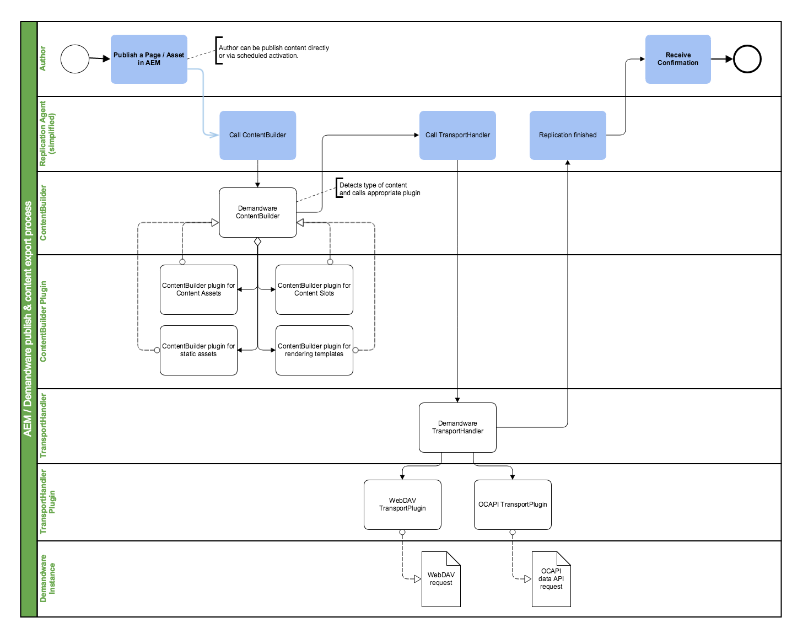

# Configure AEM to SFCC replication

This document describes the configuration & customizing possibilities of content export and replication process of the AEM SFCC connector.

## Content Publish Process
The publishing process of AEM content (pages, assets or content slot configurations) to SFCC operates as follows:

1. The editor publishes a page or asset in AEM; this can be direct, via activate later or via a custom workflow

2. The configured SFCC replication agent calls the SFCC ContentBuilder implementation

3. The Demandware ContentBuilder
   - calls one (or multiple) plugins (see below) to prepare the content to be exported
   - serializes the prepared content object; pages and configurations are serialized as JSON objects; html is encoded and also wrapped as JSON files to be transported by the OCAPI

4. The configured SFCC replication agent calls the SFCC TransportHandler implementation(s)

5. The demandware TransportHandler
   - picks up the serialized content object
   - calls appropriate plugin based on the API type (OCAPI or WebDAV)
   - the plugin pushes the serialized content to the configured SFCC instance



## Pluggable architecture of the SFCC ContentBuilder

To provide flexibility in publishing different AEM content resources like different page types, DAM assets etc. to SFCC, the SFCC ContentBuilder leverages a plugin architecture to delegate the content building steps. The ContentBuilder uses a JSON document to manage the AEM resource to be serialized and published. The ContentBuilder itself only creates the body of that JSON document but does not serialze any content; this is delegated to the appropriate plugins.

Plugins are implemented as OSGi services. Each plugin has a `canHandle()` Method to decide whether it needs to process the object at hand. 

The plugins usually are mapped to content resources by 

1. the _Sling Resource Type_  or

1. the _Content Path_ 

Based on the resource type and the resource path the SFCC ContentBuilder will call all matching plugins in order of their service ranking. Each plugin will add (add & map page properties, render components to Velocity markup, etc.) information to the JSON document. If multiple plugins handle the same object the last one has the authority over what is being exported. 

Usually you want to unwrap the JSON that is created by a predecessing plugin and add more information. Though this rarely should be necessary.

A JSON document must contain the following minimum attributes:

* **id:** the id of the document - translates into the id of the artefact created at SFCC

* **type:** the type of SFCC export (at the moment this is only OCAPI or WebDAV)
* **endpoint:** object containing the instructions where and how to send the data (this is different based on the type)

* **optional metadata:** instructions to process the request (like, template information, webdav folder, etc.)

* **payload:** the data to be send
   * for OCAPI this is a JSON object
   * for WebDAV this is a binary

> **Note:** In the default plugin, the page name is used to generate the id. Where in AEM you can use the same page multiple times (in different folders)   an id in Salesforcehas has to be unique - globally. Even though Salesforce has a folder concept it works differently than in AEM. In AEM, folders act like namespaces. And each resource is physically stored in one (and only one) folder. In SFCC the id is a global identifier. Salesforce folders can be attached optionally to an object. They are more comparable to "Tags" in AEM. Thus said - you have to make sure, that your page names are unique even in AEM. The page creation dialog might be a good place to create unique page names. Or you override the plugins id creation method to what suits your business case best.     

## Sample JSON documents

Content:
```{
   "api-type": "ocapi",
   "content-type": "content-asset",
   "api-endpoint": "/libraries/{library_id}/content/{id}",
   "library_id": "SiteGenesisSharedLibrary",
   "id": "womens",
   "payload": {
      "template": "/content/sitegenesis/templates/contenttemplate",
      "searchable": {"default": true},
      "online": {"default": true},
      "page_title": {"de-DE": "Damen"},
      "name": {"de-DE": "Damen Landing Page"},
      "c_body": {"de-DE": "\n\n    \n    \n    \n    <div class=\"category-slot parbase\">$include.slot('cat-landing-slotbanner','category', $ProductSearchResult.category, 'Large Category Landing Banner')\n<\/div>\n\n\n    <div class=\"parsys-column cq-colctrl-lt1\">\n        <div class=\"parsys_column cq-colctrl-lt1-c0\">\n            \n            <div class=\"parbase placeholder search-navigation\">$include.searchNavigation($pdict)\n<\/div>\n\n        <\/div>\n    \n        <div class=\"parsys_column cq-colctrl-lt1-c1\">\n            \n            <div class=\"category-slot parbase\">$include.slot('cat-landing-slotbottom2','category', $ProductSearchResult.category, 'Large Category Landing Banner')\n<\/div>\n\n        \n            \n            <div class=\"category-slot parbase\">$include.slot('cat-landing-slotbottom','category', $ProductSearchResult.category, 'Large Category Landing Banner')\n<\/div>\n\n        <\/div>\n    <\/div>\n    <div style=\"clear:both\"><\/div>\n    \n    \n\n"}
      }
   }
```

Asset:
```{
   "api-type": "webdav",
   "content-type": "static-asset",
   "webdav-endpoint": "/on/SFCC.servlet/webdav/Sites/Libraries/{library_id}/{scope}",
   "library_id": "SiteGenesisSharedLibrary",
   "scope": "default",
   "id": "asset.jpg",
   "path": "/content/dam/dwre/asset.jpg",
   "payload": {
      "size": 19720,
      "mimetype": "image/jpeg",
      "base64": true,
      "data": "/9j/4AAQSkZJRgABAgA ... 6fJHZUipOnFrTX8j//2Q==\r\n"
      }
   }
```
