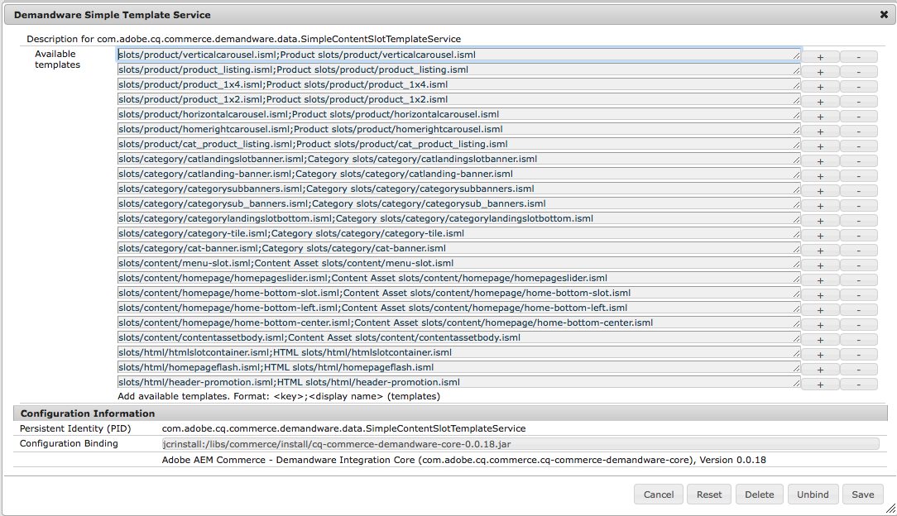
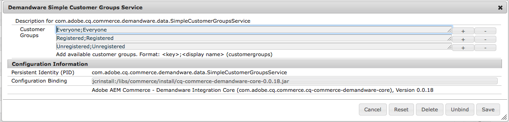

# Configure Content Slot Configuration support with AEM & SFCC

## Overview
The AEM Connector for SFCC supports the management of SFCC Content Slot Configurations within AEM. This includes support for global, category based and folder based content slot configurations. All content types for content slot configurations (products, categories, content assets, and plain HTML) are supported by the connector.


Content Slots Configurations are managed as AEM pages. The AEM Connector for SFCC provided three different templates to be used for global, category based and folder based content slot configurations.


Sample content slot configurations for all three types are provided as part of the sample content under http://localhost:4502/sites.html/content/sitegenesis/contentslots.

## Configuration
To customize the content slot configuration dialogs according to the project needs the following data sources can be configured, for used within the UI dialogs.

### Templates

ISML rendering templates available for each content slot configuration cannot be read from SFCC since AEM has no knowledge about the cartridge content. Therefore these must be configured once to be available for the UI selection.



The configuration format is 

```
<template file path>;<display name>.
```
 A sample configuration containing a preconfigured set of the template used by the SiteGenesis site is provided with the connector.

### Customer Groups
SFCC at the moment does not provide a data API to access the available customer groups directly. There the list of available customer groups needs to be configured statically



The configuration format is <customer group>;<display name>. Correct use of large and lower case is important here, the key must exactly match the customer group within SFCC. A sample configuration containing some always existing customer groups is provided with the connector.