# Configuration

## Service Factories and Singletons

The connector consists of multiple services working in conjunction. Some of the services are implemented as factories. That means you can have more than one instance of this service. The main reason for having multiple instances of one service is that you sometimes need to attach more than one Salesforce instance to a single AEM. The different service instances give you the chance to have multpiple configurations in parallel.

In a multi-instances setup, not all services need to be duplicated though. Most of the services are stateless and can be shared between multiple connectors. 

## InstanceID

Services working together in conjunction are identified by a an "instanceID". This is a unique identifier that is shared between all related services and the AEM Replication Trransport Agent. Refer also to [Multi Instance Support](8.3-Multiple-Instance) for a complete example.

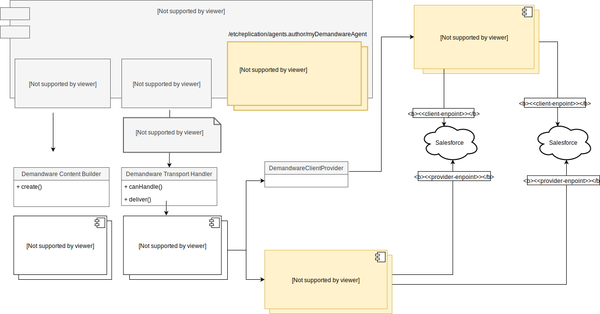

The instanceID first needs to be configured in the Replication Agent as part of the agent's target URI. The URI must be `demandware://<<instanceID>>` Where `<<instanceID>>`is substituted by the identifier you want to use for that instance. 

When the AEM replication framework calls the `DemandwareTransportHandler`, the instanceID is passed as part of the `TransportContext`. The `DemandwareTransportHandler` extracts the `AgentConfig` from the `TransportContext` and passes it to the according `TransportPlugin`. 

The `TransportPlugin` is stateless. It does not retain the instanceID. It only keeps it for the time the transport methods are run. 

When a `TransportPlugin` needs the actual **base** URLs or credentials to connect to a Salesforce instance, it asks for a `DemandwareClient` object or an `AccessTokenProvider`to provide the according information.
The endpoints have arbitrary sources. One of these is the [ContentBuilderPlugin](contentbuilderplugin). Please see [Open Issues](Open-Issues.md)

Both `DemandwareClient` and `AccessTokenProvider` are created by service factories - so there can be multiple instances.

The *DemandwareClient* to use is identified by the service property `<<instance.id>>`.

The *AccessTokenProvider* to use is identified via a combination of two service properties:

1. `<<auth.token.provider.client.id>>` must match the transport plugins' `<<accessTokenProviderId>>` while
2. `<<instance.id>>` has to match the instanceID handed in via TransportContext.

So these are the crucial properties that stitch everything together.


# Common Services 

The default configuration was designed to connect to the Salesforce SiteGenesis Demo website and a Salesforce sandbox. This is for illustration purposes, only. A productive setup would require customizations not only to the [Salesforce-specific AEM components](5.1-SFCC-ready-Components) but also to the according connector service configurations.

For the sake of clarity, we will only describe the major properties that usually need to be changed.  

## Demandware Access Token Provider (Factory)

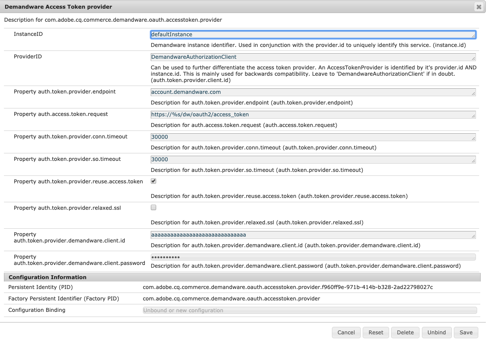

This is used to gain access to a Salesforce instance. The connector uses this service to acquire an access token, that subsequently is used in the OCAPI to transmit payloads.

When DemandwareClient sends a request to SFCC instance it use and OAuth token. The provider allows clients to obtain a token and store it in the CRX for reuse. The token is stored under The "Replication Agent system user" node. For example in Sample Content:  

```
/home/users/system/demandware/dwre-replication-agent-sitegenesis/oauth
````

> **Note:** If the token is not stored, but the replication is successful, check if user has write permissions on his own node.

### Properties
**InstanceID**: This identifies the service as described on top of this page.

**ProviderID**: This is used in conjunction with the InstanceID to further differentiate `AccessTokenProvider`s. In theory each `TransportPlugin` could use a different `AccessTokenProvider`. This is rarely used, you should leave the default setting and change only the InstanceID.

**provider.endpoint**: The hostname that is used to connect to Salesforce for authentication. In most cases this is `account.demandware.com`

**token.request**: A pattern like `https://%s/token` to build a URL for the token request. `%s` is substituted by the `provide.endpoint`

**reuse.access.token**: Salesforce creates an access token that must be used to connect via OCAPI. For performance reasons you should reuse this token in production to not have to re-authenticate upon every OCAPI request. In development - especially when you are setting up the authentication you may want to not reuse the token. Otherwise you would have to wait for the token to expire to re-try with a new setting.  

**relaxed.ssl**: If turned on, will not check the integrity of the SSL connection to Salesforce. This can be helpful to debug SSL connections (rule out SSL integrity as a cause for a problem) or if you want to eavesdrop on the connection wit a proxy (see [Trouble Shooting Guide](9.1-Troubleshooting)).

> Warning: Do __NOT__ use relaxed.ssl in Production.

**client.id+client.password**: The API client ID that is set up for your AEM instance in Salesforce's account admin console. 


## Demandware Client (factory)

The `DemandwareClient` represents the specific Salesforce instances the connector wants to connect to. 

In the `DemandwareClient` you configure the endpoints for OCAPI and and WebDAV.
  `DemandwareClient` is also used to store the WebDAV credentials and the
  Asset Download Endpoint for the PIM service. That is a bit inconsistent - but
  it saved us replicating the WebDAV and PIM services just for the sake of
  providing different credentials. 
  **Note:** This is the host, not the endpoint.

Moreover, the _Demandware Client_ provides an HttpClient that the Plugins can use to create ReST-calls. 

The _Demandware Client_ is an OSGI configuration factory. To configure a new connection to an SFCC instance, add an according OSGI config. Below is the example from the `cq-commerce-demandware-multi-sample-content` package. 


The _Demandware Client_ will not be activated if any of the mandatory properties is blank:

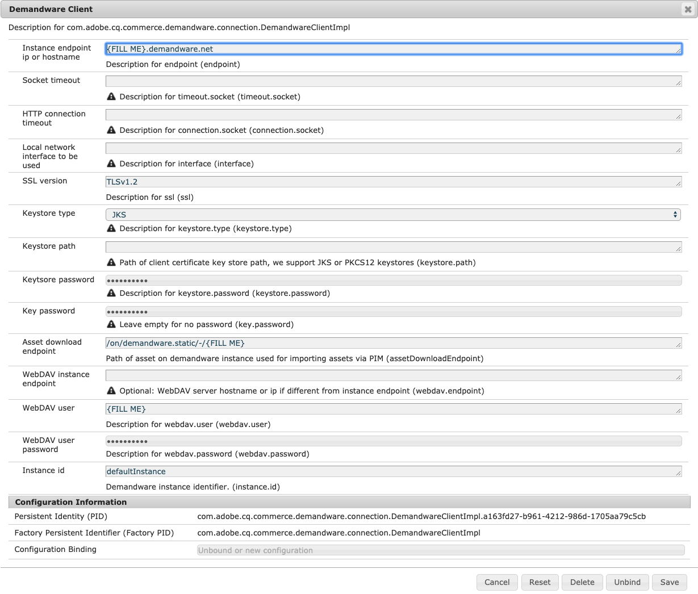

**Instance endpoint**: This is the **hostname** of the Salesforce Instance you want to connect to via OCAPI or WebDAV. This is an odd naming which should be changed.
  The endpoints are configured on ContentBuilderPlugins and in some cases on TransportHandlerPlugins, where they belong. See [Open Issues](Open-Issues.md)

**Asset download endpoint**: You can manually import catalog files from Salesforce into AEM. The files are in XML and they contain only the product core data. Product images are not part of this XML file. When you upload a Salesforce XML catalog from your local disk, AEM tries to import the according product images directly from Salesforce. Therefore you need to specify an endpoint to help AEM find the assets on the attached Salesforce instance.

**WebDAV endpoint**: The hostname of the Salesforce instance that is used to connect via WebDAV. You can leave that blank to fallback to the main endpoint.

**WebDAV User, WebDAV user password**: Credentials of an account with WebDAV access to Salesforce. The user needs write access.  

>**Warning:** In our experience, Salesforce user accounts expires after a couple of months and the password has to be re-set. This needs to be reflected in this configuration as well. You may want to contact a Salesforce representative if that issue can be solved. 

>**Workaround:** Some customer host the assets in a content delivery network. Another alternative is to use the AEM Publish system to deliver assets that are required by AEM-based components in addition to the assets that are served by Salesforce. If your integration does not need to upload assets or templates to Salesforce, you can use the  storefront preview password which is read-only and does not expire. 


# Replication ContentBuilder & plugins

## ContentBuilder Plugin for DAM Asset > static file asset transformation

This ContentBuilder plugin is used for exporting AEM DAM assets to static files on the SFCC WebDAV share.

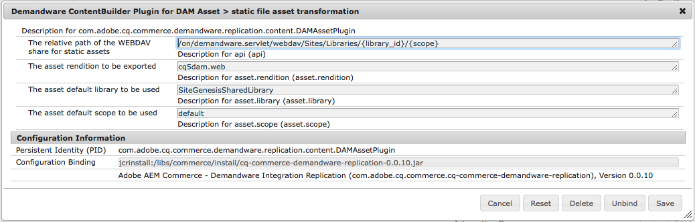

**Relative Path**: A pattern, that defines where to store the images on the WebDAV share. The pattern has the form 

```
/on/demandware.servlet/webdav/Sites/Libraries/{library_id}/{scope}
```

Where {library_id} is substituted by the mapped Salesforce library and {scope} by the mapped scope (See below)

**Asset Rendition**: The Asset rendition that is supposed to be exported. We advise not to export the originally uploaded image, since you have no control over the dimension Authors upload - and it could lead to problems if the user upload 10 MegaPixe images to AEM Assets.

**Default Library**: Salesforce can either use different libraries for each site or the sites can use a shared library. Which library actually is used is determined by a property `dwreLibrary`that needs to be defined in the content-tree below /content/dam. When an asset is replicated, the connector tries to find this property in one of the asset's ancestor nodes. The property in the closest ancestor is chosen, thus you can have an inheritance scheme with multiple overloads on the path. If no property is found, the connector falls back to this default.

**Default Scope**: The scope usually is used to differentiate the language of an asset: If for example, a product packshot contains text in a local language you may want to upload it to a different scope. The connector looks for the property `jcr:language` in the ancestor path of the asset. If it cannot find any property it falls back to this default.

## ContentBuilder Plugin for Page > Content Asset transformation

This ContentBuilder plugin is responsible for the Page > Content Asset transformation and the mapping of page properties to content asset attributes. It does not render the actual body content -that is handled by a separate plugin. This plugin rather reads page properties and maps them to OCAPI variables.

**Resource Types and Ignored Resource Types**
The plugin will only be triggered for configured resource types which are on the supported list and not on the ignored list.

**Default Library**: Same as default library for assets (see  above). The property `dwreLibrary` can also be placed in the `/content` tree for the site.

**OCAPI Path**: The ReST path on the OCAPI that will be called by the according transport handler. E.g. `/libraries/{library_id}/content/{id}.`
  **This is the actual endpoint as opposed to the host which is set on the DemandwareClient under the same name.** 

> Endpoints can be parameterized by adding placeholders in the form `{param}`.
  Each of these placeholders will be replaced by a value created by `ContentBuilderPlugin`s
  on the envelope of the transmission. Unmatched parameters will be replaced by the
  empty string `""`. The parameters usable in these endpoints therefore are dependend on the information
  `ContentBuilderPlugin`s provide.

This plugin provides two parameters:
  
  - `{library}` will be substituted by the inherited property `dwreLibrary` or the default (see above)
  - `{id}` is the ID of the content asset. By default it is derived from the page name, but this behavior
    can be overridden by implementing `ContentAssetNameResolver`.

>**Warning:** Page names of assets in AEM must be unique to use them as an `id` on SFCC. 
>  Otherwise, assets will overwrite each other on publishing. You can implement
>  `ContentAssetNameResolver` and register it with a service ranking above 0
>  in order to implement your own conventions for deriving asset IDs.
>  Note however, that if content assets are edited in several language versions
>  they need to share the same ID in order for these language versions to be
>  merged into one asset in SFCC.

**Mapping**: To customize the page property mapping, change the config for "Page attribute mapping". The format consists of four parts which are separated by semicolons `;`:

1. Name of the page property in the JCR
2. Name of the corresponding SFCC property - this key follows OCAPI rules
3. Converter ID - see converters below
4. Default value

> Note: All whitespace is trimmed from all parts of this configuration property.

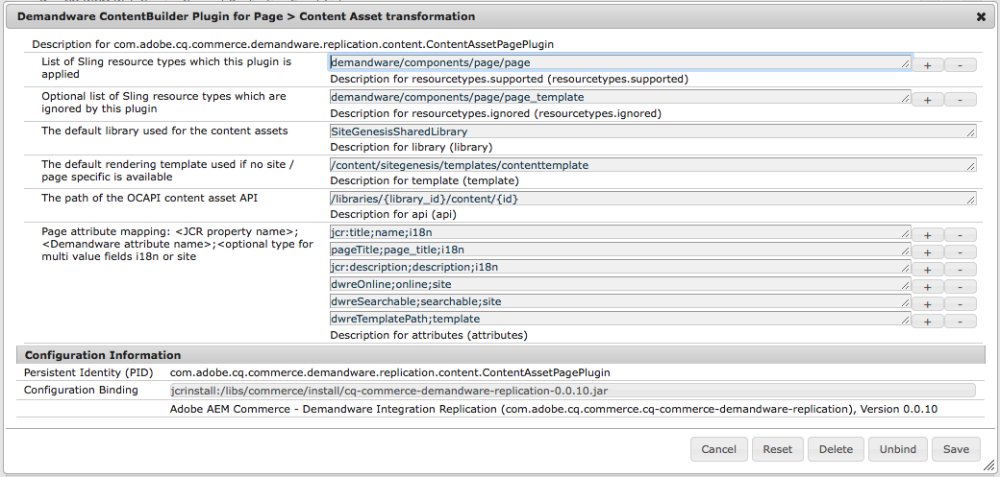

### SFCC folder based mappings

In SFCC classifications can be addressed via folders. In AEM these folders can
  be set via the page property `dwreFolder : String[]`. Since each folder defines
  its own attributes and expected default values, in AEM attribute mappings can
  also be set via `Demandware ContentBuilder Plugin for Page > Folder Attribute Assignments`.

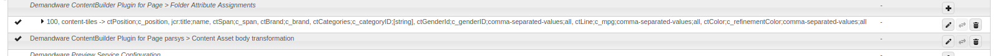

These assignments hold a priority setting (highest number wins) as well as a
  list of folders which the assignment applies to and an additional list of
  attribute mappings. The format of these mappings is the same as stated above.
  Any folder based assignment with any priority will replace default mappings
  if the assignment is applicable regarding its `folders` property.

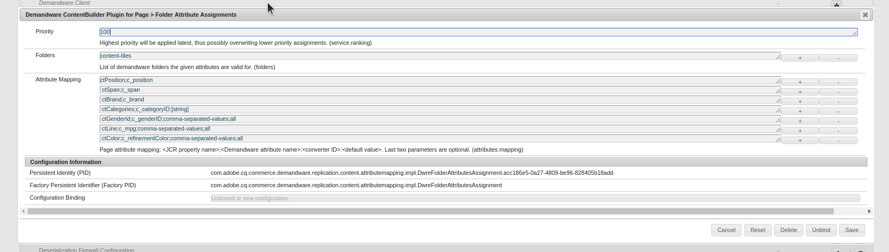

### Converters

There are some standard converters that can be used out of the box. In order
  to use them their ID has to be present in the third field of an attribute
  mapping.

1. **ID:** (ID=empty string, default): This converter simply places the input
   value untouched into the output stream. It will be selected if the ID part of
   an attribute mapping is empty.
2. **i18n:** Wraps the input in a dictionary of which the only key is the ISO
   locale of the page. The input is placed as the value of that key.
3. **site:** Wraps the input in a dictionary of which the only key is the
   inherited page property `dwreSite`. The input is placed as the value of that
   key.
3. *[string]:* Reads the input value as a string array and writes it as an
   JSON array to the output.
4. **comma-separated-values:** Reads the input value as a string array,
   joins its values together using a comma `,` as the separator and
   writes the resulting string into the output.

> Note: Unknown converter IDs are ignored and the default converter is used
>  instead. You can implement your own converters by implementing the
> `AttributeToJsonConverter` interface, though. Thus, adding your own project
> specific converter IDs.


## ContentBuilder Plugin for Page parsys > Content Asset body transformation

This ContentBuilder plugin renders the AEM page parsys into Velocity & HTML markup stored in the c_body of the content asset. The plugin will only be triggered for configured resource types which are on the supported list and not on the ignored list.

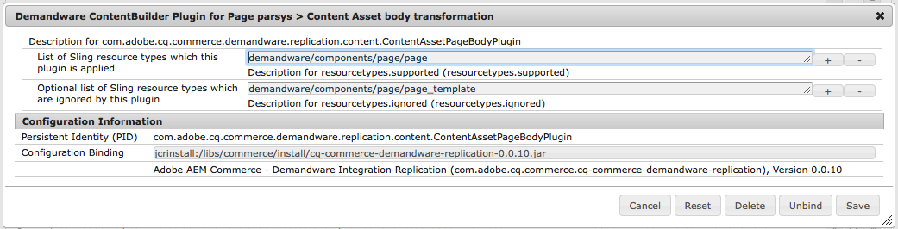

## ContentBuilder Plugin for Page > Velocity rendering template transformation
Plugin to transform and render AEM pages of the configured resource type to Velocity template files uses for page rendering at SFCC.

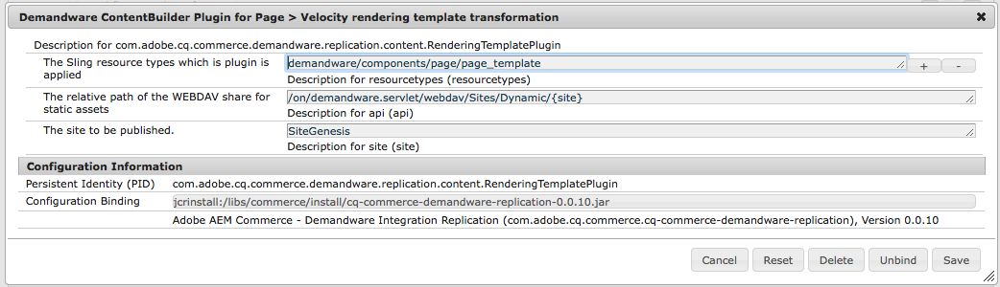

## ContentBuilder Plugin for Page > Content Slot Configuration transformation
Plugin to transform and render AEM pages using a content slot config template of the configured resource type to Content Slot Configuration within SFCC.

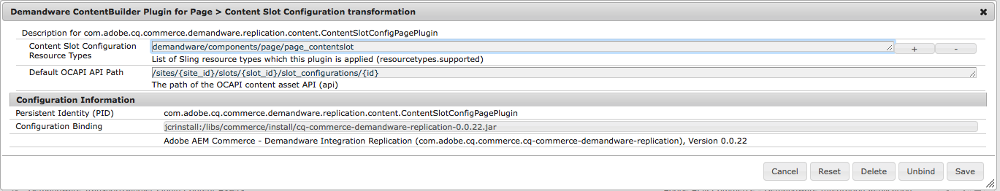

# Replication TransportHandler & plugins

All transport handler plugins currently allow for the following basic
  configuration:

- **`accessTokenProviderId`:** The ID of the access token provider to use
- **`ocapi.path`:** defaults to `"/s/-/dw/data"`
- **`ocapi.version`:**  defaults to `"v17_6"`

> **Note:** OCAPI path and OCAPI version should be the same for one
>  `DemandwareClient`. See [Open Issues](Open-Issues.md). 

## TransportHandler Plugin Content Assets
TransportHandler plugin to deliver content assets JSON data via OCAPI.

Currently, there are no additional settings required in that plugin.


## TransportHandler Plugin Content Assets Folder

TransportHandler plugin to associate content assets to selected content folders via OCAPI.

Additional setting:

- **`ocapi.ep`:** The endpoint to use for setting applying folders to content assets.
  Defaults to: `"/libraries/{library_id}/folder_assignments/{id}/{folder}"`


## TransportHandler Plugin for WebDAV

TransportHandler plugin to deliver static assets, template files etc. to a WebDAV share.

Depending on the SFCC instance this TransportHandler Plugin needs some extra
  configuration to work with SFCC 2FA for WebDAV and client certificates.
  The WebDAV client certificate must be imported into the JVM keystore which
  must be configured of the `DemandwareClient` config (see above).
  Additionally the certificate based WebDav endpoint must be set for this
  transport handler. See SFFC documentation for details.


## Preview Service 

The preview mode in AEM sites is used to preview the components of the Salesforce instance on the page. To do this, the correct Demandware client must be addressed for each page. A preview service configuration with the following properties needs to be set up.

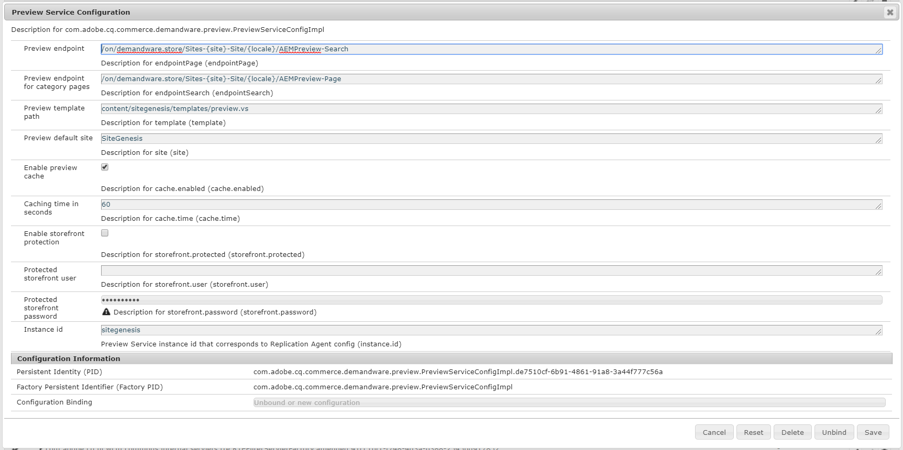
#### Properties

* `Instance id` -  Preview Service instance id that corresponds to Replication Agent config (mandatory).

* `Preview endpoint` - TBD (mandatory). 

* `Preview endpoint for category pages` - TBD  (mandatory). 

* 'Preview template path' - TBD  (mandatory).

* `Preview default site`- TBD (mandatory). 

* `Enable preview cache` - TBD optional. 

* `Caching time in seconds`- TBD optional. 

* `Enable storefront protection`- TBD optional.

* `Protected storefront user`- TBD optional. 

* `Protected storefront password`- TBD optional.
