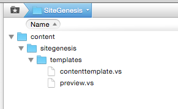

# AEM Salesforce Commerce Integrations Setup Instructions

This section will cover how to successfully set up and configure the AEM integration with a SFCC Sandbox using the SiteGenesis demo website. You will have to adapt the steps when you setup a production- or integration environment with customized components.

### Requirements

* AEM 6.4.5 instance
* SFCC Instance

>**Note:** Be careful with all steps containing SFCC user id's and passwords. If a wrong password is used (especially for the sandbox admin user) the account gets locked on SFCC and needs to be unlocked first!

## Installation & Initial Configuration Steps

### AEM Installation

* Install and start AEM Quickstart as author instance

* We assume, that your AEM instance runs on localhost:4502 with the default-admin password unchanged.

* Install Service Pack 6.4.5 (The connector genreally works with older versions but you might have to adapt the dependencies when building the connector)

* Build the project with Maven:

```
[commerce-salesforce] $ mvn install -P autoInstallPackage
```

or

```
[commerce-salesforce] $ mvn install -P autoInstallPackage,installSampleContent,installBaseConfig
```
This builds and installs all bundles and the `content` package containing components, templates, ui-elements and a default replication agent.

The profiles `installBaseConfig` and `installSampleContent` trigger the installation of some basic OSGi configurations and test-content. You can use these base configurations to build your own packages. 
You would not install these packages when you already have set up you own configuration. 


### AEM Configuration
The server connection between AEM and the SFCC Sandbox needs to be configured. Most of the configuration is already preconfigured to work with the provided optional `content-sample` package using default paths, libraries, etc. If the connector is used with other sites and libraries, these need to be updated and adopted.

### Connect AEM with an SFCC Instance

* To configure the SFCC sandbox endpoint go to the [Felix OSGI console](http://localhost:4502/system/console/configMgr).

* Configure 'Demandware Client' to set instance endpoint and SSL protocol. The endpoint must contain the SFCC instance hostname only, not protocol, etc. You also need to set the WebDAV user and Password here. 

### Configure content replication

* Go to the [Replication Agent Configuration](http://localhost:4502/etc/replication/agents.author/demandware.html)

* Check if the replication agent is enabled.

* The replication agent is configured to info log level by default. If something doesn't work or you need more information, you can switch to debug log level.

### Configure OAuth

The OAuth client is configured to work with a SFCC developer sandbox instance using default credentials. For staging and productions systems the OAuth clients need to be configured with appropriate client id & password - ideally in a separate package.

* Go to the [Config Manager](http://localhost:4502/system/console/configMgr)

* Configure the "Demandware Access Token Provider". For SFCC developer sandbox usage the values should be fine, for other instances provide your client id and password.

## Initial Template Provisioning 

AEM can be used to deploy templating code to Salesforce. Do not mistake the Salesforce templates by AEM templates. Salesforce uses "Velocity Script" for templating, wheras AEM uses HTL or JSP code. 

For the SiteGenesis demo site to work, AEM needs to deploy a few Velocity Scripts to Salesforce - though thos is optional in a productive or a customized environment. 

The following wizard is part of the optional `content-sample` package. It is provided as part of the demo content package to help set up the SiteGenesis demo pages.

* Go to [etc/demandware/init](http://localhost:4502/etc/demandware/init.html)

* Click "Edit" and verify the correct username & password!

* Click on "Initialize"

* Login to SFCC WebDAV folder and check for published template files

