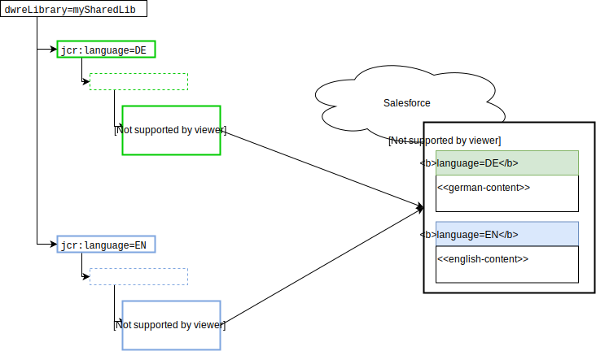

# Content Mapping and Markup 

Content in AEM is organized in one large content tree.  

The structure that salesforce in contrast is subdivided into "libraries" - content slot configurations and content assets are organized in a flat structure, that is, they are id-based not folder and name based.  

The connector needs hints how to map the content from the content-tree into the libraries. 


## Instances

>**Note:**  As of version 2.0 of the connector, AEM is able to connect to more than one Salesforce instance. 

The instance-connection needs to be configured at three different points in the AEM system

* In the **Replication Agents**, the target URL is set up as `demandware://<instanceID>`. 

* The `instanceID`s are then used to identify an according **OSGi config** for a `Demandware Client Service`. You define the actual "https-endpoint" in the service configuration (not in the agent as for standard replication agents).

* The Salesforce preview mode in AEM also needs to connect to a Salesforce instance to display the contents of slots and placeholders. During rendering, AEM does not have access to the Replication Agent, thus i doesn't know which Salesforce instance should deliver the content for the slot. Therefore you need to place a **property** `dwreInstanceId` somewhere in the **content tree** above the page that currently is being rendered. If you have more properties of that name defined, the preview service picks up the property of the nearest ancestor. You can use that to implement a default at the docroot or even a fallback cascade.  

> **Note:** dwre* Configuration properties must be place in `jcr:content`node in the ancestor path of the page or asset. 


User can set properties on jcr:content node to control which Site or Library will be used on SFCC instance:

## Content Slot Configurations and Constent Assets

Place the following properties at the root folder of the subtree that represents your site:

* `dwreSite` - case-sensitive name of Salesforce Commerce Cloud Site the content is stored into

* `dwreLibrary` - library name of of Salesforce Commerce Cloud Content Library. Used for Replication.

* `dwreInstanceId` - used to find matching DemandwareClient config for Preview mode on AEM Page (see above)

* `jcr:language` - See "Multi-Language Support for Pages"

## Multi-Language Support for Pages



An object of the type _Content Asset_ or _Content Slot Configurations_ in Salesforce can host the same content in multiple languages. AEM has a different approach: Each _Object_ (= _Node_) only has one language. Multiple language version of the same content item usually are stored in different subtrees - where the subtrees can be connected by an MSM language-copy relation.

As said before, Salesforce objects in AEM are identified by their page name. When you export two different nodes from AEM to Salesforce with the same name into the same library, usually the latter overwrites the former... 

... unless they have a different language. In that case, the latter export augments the already existing version with an additional language variant.

* You need to set the `jcr:language` property to one of the page's ancestor nodes to define a language for that node.


## Assets

* `dwreLibrary` - library name of of Salesforce Commerce Cloud Content Library. Used for Replication to WebDAV folder.

* `jcr:language` - Assets in Salesforce are organized into libraries and **scope**s. You define the scope of the WebDav folder by setting the `jcr:language` in an ancestor node. The default value is "default" and can be re-defined in the OSGi config. 

The WebDAV path for assets is build of the pattern:

```
/on/demandware.servlet/webdav/Sites/Libraries/{library_id}/{scope}
```

Check sample content for an example.
