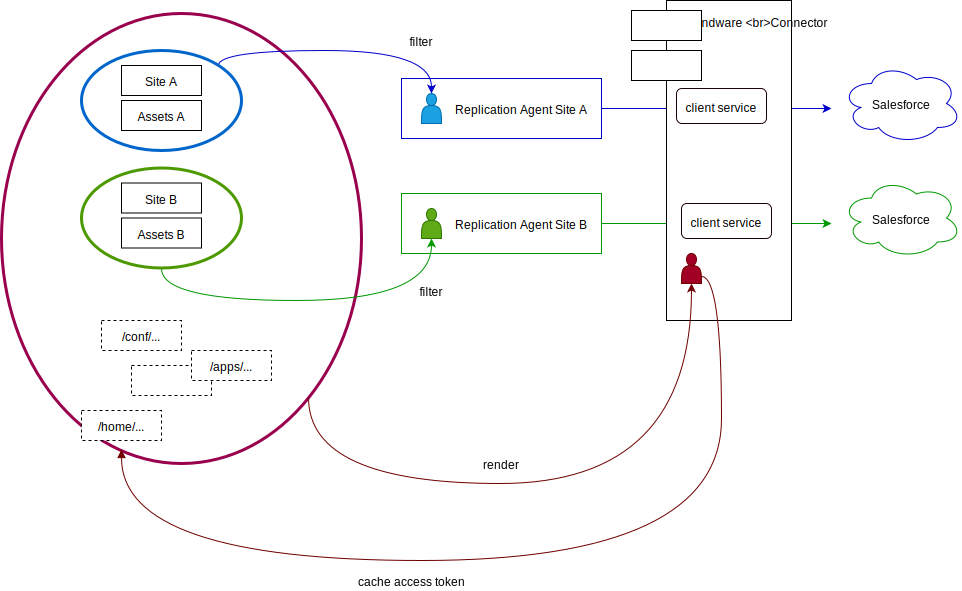

# Users and Permissions

The connector setup requires at least two different system accounts to work properly.

*  **Demandware Replication Service User-Account**: This is the system account the connector OSGi services use to actually render a page.

* **Replication Agent User-Account**: This is the account, the replication framework uses to decide if a resource is replicated to a specific Salesforce instance. The user account works as a filter to the replication event. When the associated *User Account* has no read access to a resource, the *Replication Agent* ignores the request. 

## Demandware Replication **Service-User-Account**

This system user is responsible for all operations on repository needed for Demandware Connector functionality. 

The sample content package includes a system user mapping for a system user `dwre-replication-service`. 

## Permissions

### Read Access

The replication service user usually needs more access rights, than just for the subtrees `/content/<<mysite>>` and `/content/dam/<<mysite>>` you want to export. Usually the service user also needs read-access to configuration resources that can be in `/conf`, `/apps` or `/libs`.

You should adapt read-access according to your application.

These permissions are needed to be able to render the payload for replication of pages and assets.

### Read/Write Access 

`/home/users/system/demandware`

This folder contains all users related to the Demandware Connector. 

The write access is needed to create an "oauth" subnode under "Replication Agent User" node. This node is used to store the access token provided by the _Access Token Provider_ and used for subsequent OCAPI request. 

For content-sample example it can be found at `/home/users/system/demandware`.

## Replication Agent User-Account(s)

Apart from `dwre-replication-service` itself, you should set up at least one more system user, that is assigned to the _Demandware Replication Agent_. In the Module `content-sample` for example, it is the user `dwre-replication-agent-sitegenesis`. 

This user ensures that Replication Agent handles only content it is assigned to (via user permissions).

### Read Access

The account only needs to read-access to `/content/<<mysite>>` and `/content/dam/<<mysite>>` 

## Advise

> Don't use the same *User Account* for the *OSGi Service* and the *Replication Agent*. Do not grant the `Replication Agent` access to subtrees, that should not be exported to Salesforce. Even though, the connector will eventually ignore the Replication requests, it is triggered anyway. It performs a few unnecessary computations... and stop the process with an Error-message. And having too many error messages in the log file will hinder you see real problems...

