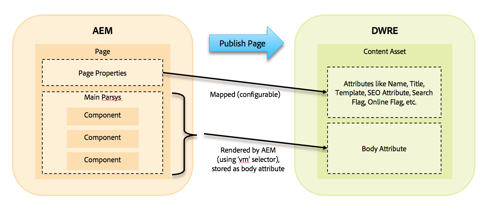

# Build SFCC ready components

This document describes the minimum requirements and how to steps for creating a "SFCC enabled" component within AEM.

## Basics

Each AEM component can be used with the AEM SFCC integration. There are two types of SFCC components within AEM:

* *AEM-only* components - where AEM can render the component without any help. These are usually marketing oriented, a more static component like images, text, teasers, carousel, hero banners, etc.

* *SFCC enabled components* -  where AEM requests SFCC to render the component's content. These are typically more dynamic components, for example, product boxes or navigation components.

Depending on the purpose of the component additional steps are needed to make it work.

When a page is exported, the `parsys` of the current page is statically rendered and wrapped into a JSON object to be transmitted to the OCAPI interface of Salesforce.

The *AEM-only* pages are statically rendered as HTML markup into that export - just like it would be for a rendering for a browser. 

## Preview

*SFCC-enabled* components look like normal AEM components. For editing within AEM they are placed on a page like any other components.

The difference occurs, when the the component is exported or rendered.

For SFCC-enabled components, the preview-rendering and display of the dynamic data is performed by the SFCC instance. AEM serves as a mere proxy for that component and uses the preview function of the SFCC instance to pre-render the content fragment and then passes this through to the editor's browser.

## Export

The content of a page, edited within AEM, is published into a *Content Asset* to SFCC. The descriptive attributes of the content asses (name, page title, template, SEO attributes) are maintained as page properties of the AEM page. The content of the AEM page content parsys is rendered and stored as the body of the content asset.

To transform dynamic elements of a component (image paths, links to products or category, etc.) into the matching dynamic tags for SFCC a special script file is required for each component which renders the appropriate Velocity markup for that function. The name of the script file must match the “vm” Sling selector, which is automatically added to each request during the publishing process of the AEM page to SFCC. A component implemented using HTL will use vm.html.

Example of vm.html HTL script for an image component: 

SFCC provides dedicated script helper functions for Velocity to be used to render dynamic page elements, like: $link.static(‘…’), $link.product(‘…’), $include.footer(‘…’). A full list of these scripts is available via SFCC.
For dynamic components, which require SFCC to render the component content fragment for display within AEM a special placeholder component is provided by the AEM SFCC integration: /apps/dwre/components/placeholder/placeholder This component itself is hidden and not intended to be used on a page directly. It already implements the SFCC preview call and should be used as sling:resourceSuperType for all components which require this functionality. See example header, footer, and product component.

### Recommendation
* Use HTL for all components
* Use placeholder component as sling:resourceSuperType for all components which require a dynamic SFCC preview