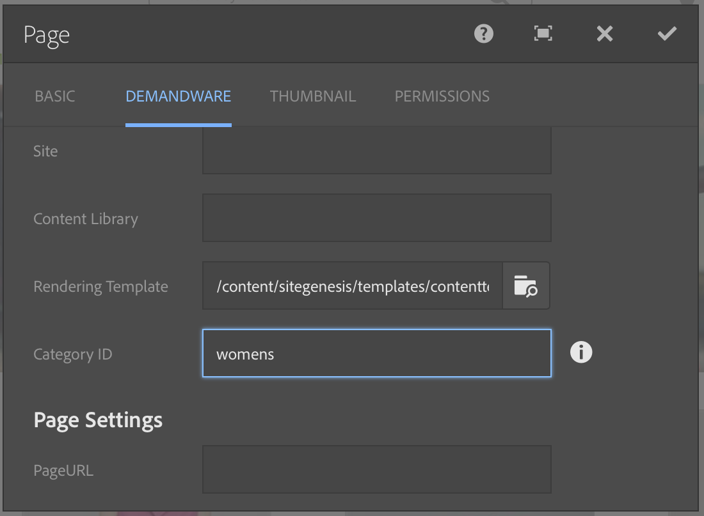
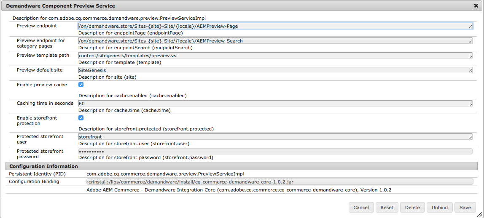

# Preview SFCC content live in AEM

## Overview
AEM components can render live content/data from SFCC during content editing and preview in the AEM content editor. 

The live SFCC preview works on AEM component level, each component can use the preview service (see below) to render a live preview of a particular content piece (HTML snippet). 

To avoid unnecessary server roundtrips between AEM & SFCC, the rendered content piece can be cached on AEM if appropriate. 

The SiteGenesis sample pages make heavy use of this by including live header, footer or content slot components.

The _Component Preview Service provided_ by the AEM Commerce Connector for SFCC is used to render the live preview via the SFCC sandbox and inject the rendered HTML into the AEM component.

## Category Landing Pages and Category ID

For category landing pages or other pages related to a SFCC product category, the preview service requires the SFCC `category id`. 

## Mapping AEM Resources to Demandware IDs 

There are two mapping options implemented by the connector. The default mapping uses the page name of the AEM page as category id. This is very straight forward as this will be used later during content publishing as well. 

This behavior can be overwritten by storing the `dwreCGID` property at the page. If the `dwreCGID` is present, it will be used instead of the page name. The value of the property must exactly match the category id within SFCC. This method is useful for preparing and testing the future version of a page. The connector already provided a special page template called _SFCC Category Page_  which allows setting the optional `dwreCGID` property in the page properties dialog.

>**Note:** Beware, that this property is copied, when you copy resources representing SFCC objects. Thus you might end up with two resources, that mutually override the according SFCC object. The later export overwrites the earlier one. 

## Prerequisites
The SFCC instance needs to have the Adobe Connector cartridge installed with the preview services configured. The preview rendering template (see configuration below) needs to be present on WebDAV at the configured path. The preview template can be published from within AEM Author to WebDAV and essentially just contains the "$html" directive.

## Configuration
The Component Preview Service is configured via the OSGI service.

The SFCC instance needs to provide two preview endpoints. There is one for all "normal", not category related content pieces / components and one for components which have a relationship to a SFCC product category. The second one used an additional category id parameter to give SFCC the category context while rendering the preview. This is used for example for content slot or search/category navigation components.
The endpoint URL's can have placeholders for "site" and "locale" are dynamically replaced by the SFCC site setting and locale of the page which contains the component rendering the preview.
The preview template path needs to point to an exiting rendering template file on the WebDAV share. The connector provides a standard preview page which can be used by simply publishing the page.
If the SFCC Storefront is password protected, as is often the case for staging or preview environments, enable storefront protection checkbox must be selected and the storefront username and password are required.

## Development / Customization 
Live content preview of dynamic SFCC content can be accessed by the 

`com.adobe.cq.commerce.demandware.PreviewService` 

and

`com.adobe.cq.commerce.demandware.components.PreviewHelper` 

(for HTL Components). Both services are provided by the connector.

The connector also provide a common base component `/libs/commerce/demandware/components/placeholder/placeholder`
to integrated the live SFCC preview. This should be used as Sling super resource type for custom components.