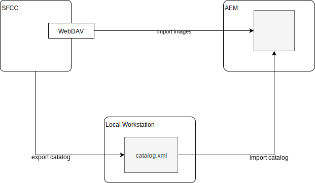

## Product Import Managment  
Products can be imported and stored within the AEM instance. Therefor we need to import XML files that contain the product information. 

Once these products are imported, its easy to add them on specific sites by choosing the product id. (See 
[AEM Tutorial Commerce Video](https://helpx.adobe.com/experience-manager/kt/commerce/using/demandware-feature-video-understand.html))

### How to Import XML Product Files

The import of a product is a three-step process:

1. First you export a catalog from SFCC to your local machine.

2. You import the catalaog into AEM using the import wizard as described below:

-	Configure *"Asset download endpoint"* within DemandwareClient Configuration
-	Within AEM navigate to Commerce ->  [Products](http://localhost:4502/aem/products.html/var/commerce/products)
-	Click “Create” -> “Import Products” and a dialogue opens
-	Configure the Demandware store name, select the instance id of corresponding Demandware Client and add your XML file
-	Click "import" and the products of the catalog are imported

3. The catalog file only contains the products meta data. The product images are not part of the export. To make the images available within AEM, the importer downloads the images from the `Asset download endpoint` as configured in the `Demandware Client` Service. This can take a while.  

The imported products are stored in the repository under `/var/commerce/products`and can be found under "Commerce > Products" in the UI.

