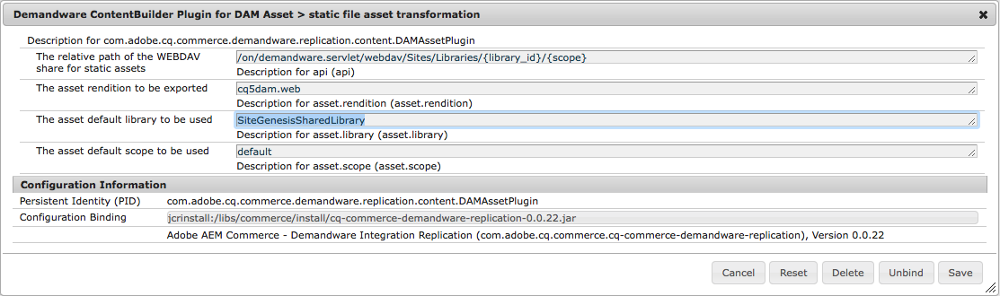

# Multi-library support for AEM Assets replication to SFCC

AEM Assets can push DAM assets to multiple SFCC libraries on WebDAV.

## Solution & Configuration

The AEM Connector for SFCC supports a 1:1 relation where one DAM asset gets pushed to one WebDAV library. This functionality is based on folders within the DAM. One asset within a AEM Assets folder (or subfolder) will be exported to one SFCC asset library on WebDAV. If an asset should be used at several SFCC sites we recommend to use a shared WebDAV library. If that approach is not possible multiple DAM folders can be used within AEM which are mapped to dedicated WebDAV libraries.

A "library-folder" is configured with the correct mapping for the SFCC library to be exported to. This config is inherited and used for all assets in that folder or in subfolders of that folder.
```

{"jcr:primaryType": "sling:OrderedFolder",
   "jcr:content": {
     "jcr:primaryType": "nt:unstructured",
     "jcr:title": "Demandware",
     "dwreLibrary": "SiteGenesisSharedLibrary"
   }
}
```

The property `dwreLibrary` can be set at any folder level in the `jcr:content` node of the folder (see the `content/dam/sitegenesis/.content.xml` in content-sample). There is no user interface for setting the folder property. You should either use CRXDE or deploy the basic structure with a content package.
If no `dwreLibrary` property can found during the replication of an asset the default library (configured at the OSGI service) is used as a fallback option.



## Customisation & Extension
For your special use-cases the suggestion is to build the functionality by creating a special rollout configuration for live copies. If a live copy gets created, the rollout config can duplicate the assets (via custom MSM live action) and update the asset references on the page. If the original page gets modified, the rollout config works the same way. Publishing a page will now work with the out-of-the-box and an easy to understand 1:1 folder mapping.