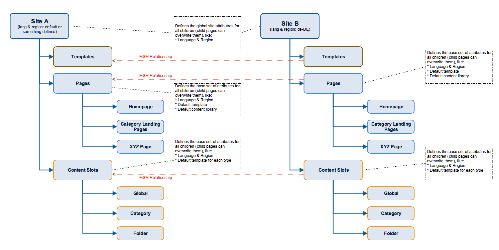
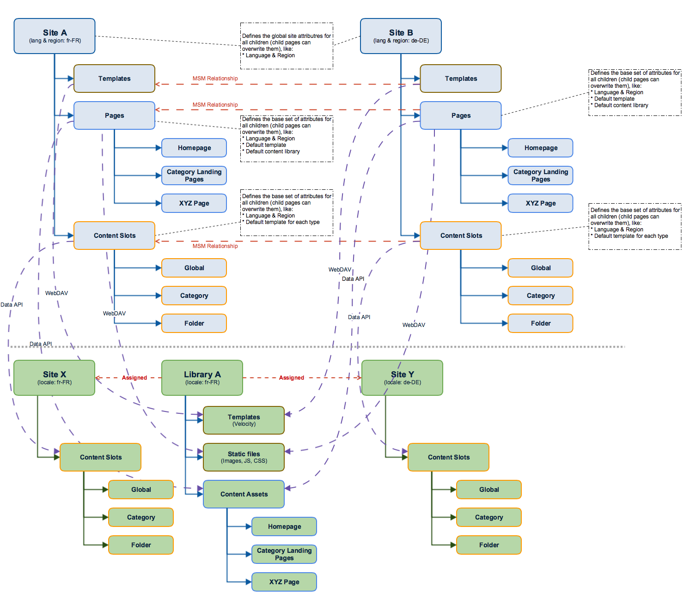
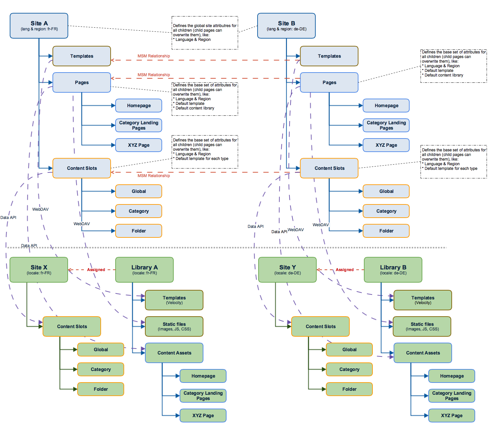

# Setup a multi region / multi languages site with AEM & SFCC

## Information Architecture / Page Structure
The following diagram shows the site reference structure within AEM for a typical AEM / SFCC setup.

The global sites (Site A, Site B) and the root pages for Templates, Pages & Content Slots are not intended to be published. They are containers to manages global properties like language & region settings, default values for templates to be used, status flag for searchable, online, etc.. These properties are inherited to all child pages but can be overwritten on individual child pages if needed.

"Pages", "Content Slots" and "Templates" as well as their children are all AEM pages. "Pages" are exported as content assets, "Content Slots" are exported as content slot configurations. Content Slot pages contain the content slot configuration (content to be displayed, template path, schedule information, etc). To use a content slot (already existing or manages via AEM) the connector provides a component to be used on a page manages via AEM. Template pages and DAM assets (not shown in the diagram) are exported to WebDAV. 

## MSM

MSM  is used to maintain global site structures with multiple languages/regions. The goal is to stay with standard MSM as much as possible.

Refer to the diagram above: Site A defines the MSM blueprint which is used as default or one individual language & region (depending on the customer setup). All other sites manage content for a different region and/or language. Properties like default templates and others are inherited while the language property is not. 

During the publishing process, the AEM SFCC connector can detect this relationship and will publish language/region specific pages into to same content asset/content slot with SFCC. The connector will transform AEM all multi-language page properties (like title, description, keywords, online flag, search flag etc.) into the configured attributes at SFCC. The AEM page parsys of each language specific page will be exported into the body attribute of the content assets for the individual language.
All AEM MSM rollout functions can be used to transfer content from the blueprint page to the live copy (language page). Including canceling inheritance to allow the language pages any kind of individual customization.

## Mapping of AEM content to SFCC

| AEM           | SFCC          |
| :------------ |:------------- |
| Content Pages (page properties & parsys) | Content Asset (content asset attributes & body attribute of the content asset) |
| Content Slot Pages (page properties & page components based on content slot type) | Content Slots Configurations |
| Template Pages | Velocity template scripts on WebDAV share|
| Assets | Static assets on WebDAV share |

## Mapping of AEM site structure to SFCC
There are two different approaches to mapping the AEM site structure for use within SFCC:
1. multiple sides use a shared library (first diagram) 
1. multiple sides use separated libraries (second diagram)
The decision which approach is used is up to the project and not directly related to AEM. Both approaches are supported by the AEM / SFCC integration and the connector must be aware of it. 

