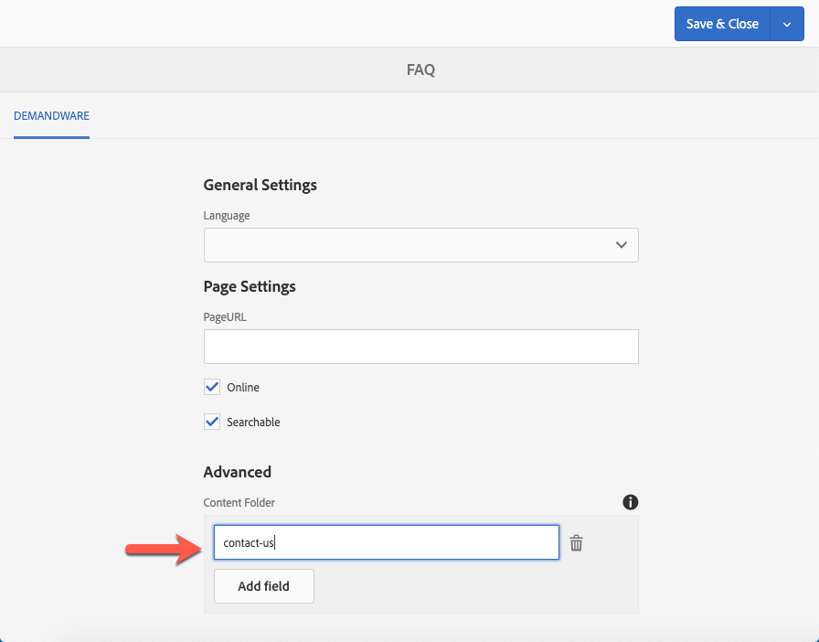

# Known Issues

## Page Names and Unique IDs

The connector assumes that the page name is used as an ID for the SFCC object if the ID is not set explicitly. 

Both cases do not guarantee, that th ID is unique. To prevent two AEM resources from overwriting their respective SFCC objects upon exporting, you have to take additional measures to make the IDs unique.

## Missing Category ID

The connector assumes, that you only use valid Category IDs from salesforce. If you export a resource with an invalid Category ID, the export fails and all subsequent replication jobs in the queue are blocked.  

## Folders in Salesforce

Folders in Salesforce Commerce Cloud follow an entirely different concept than in AEM:  

Where in AEM a folder is a location, where a resource is "physically" stored, in SFCC a folder is more like a tag from a hierarchical taxonmy that can be attached to an object optionally. An object in SFCC can have multiple "folder" assignments. In AEM each resource is stored in one folder, only.

The connector addresses this mismatch as follows:

- AEM-folders are not exported to SFCC

- The connector assumes, that the resources are accessed  in AEM only where they are already strucutured - so there is no need to re-build that structure in SFCC again. 

- If you need to assign a folder to an object anyway, you type in the folder name(s) into the field `Content Folder`:

> **Note:** Folder names are not imported yet by the connector. 

### Deleting Folder Assignments

There is one issue with the folder approach above. When you remove the folder assignment in a resource, the Connector cannot know that it was there before. The next time you export the resource any trace of that folder in AEM is lost, so the Connector is not able to remove the folder assignment. That would have to be done manually in the UI of SFCC.

### Non Exiting Folders

When an asset is assigned to a folder that does not exist in SFCC, the export of the resource fails. 

## Preview Cartridge on Salesforce Marketplace

Some of the preview functionality assume, that you use a special cartridge installed in SFCC. 

Unfortunately, it was removed from the market place, lately. If you plan to use this integration module, you may ask your Salesforce representative if they can provide the required functionality.

Alternatively, you adapt the preview implementation to 
work without that cartridge. 

We know of at least one customer-project, that uses HTML rendered the storefront for the preview in AEM. The storefront 
HTML is prepared with HTML comments that are used to cut the page into HTML-fragments that are then fed into the
preview rendition.